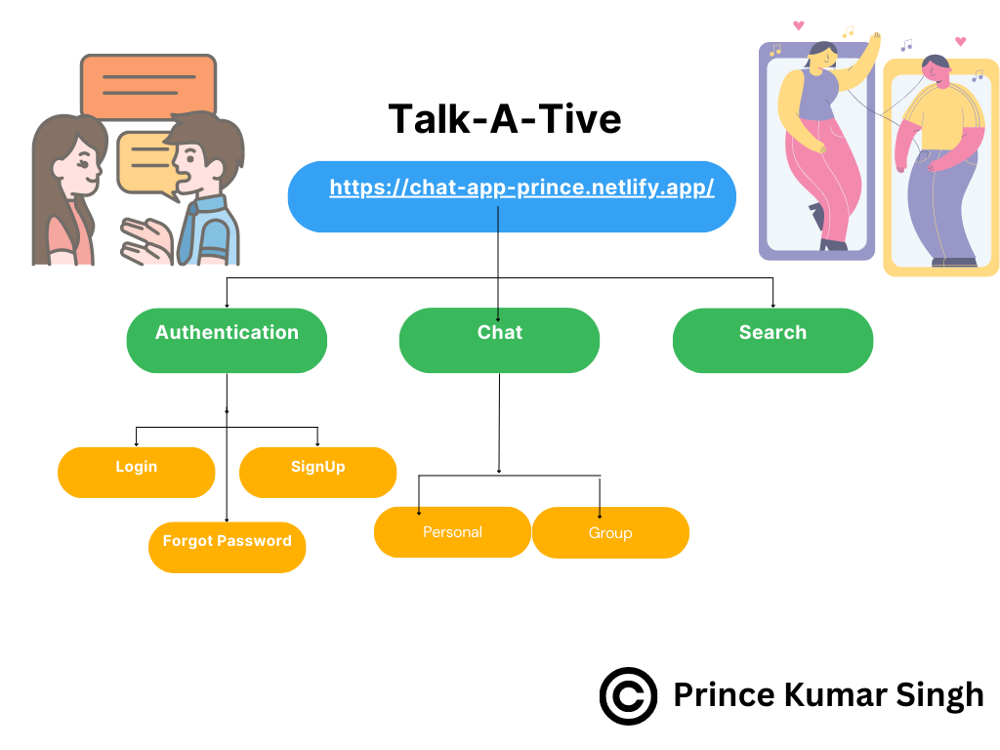
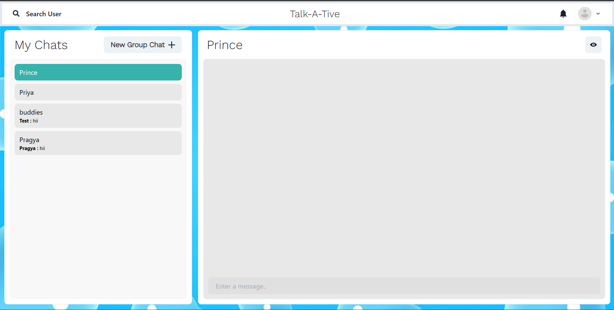
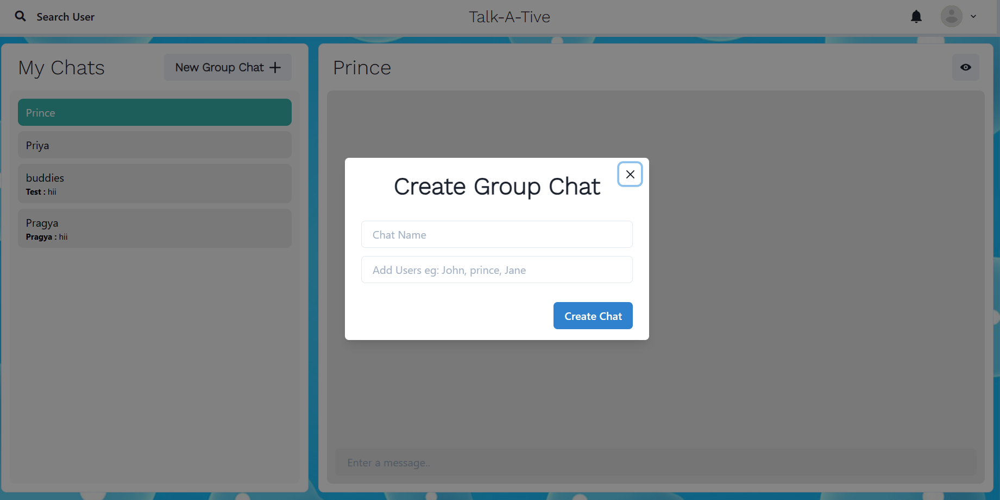
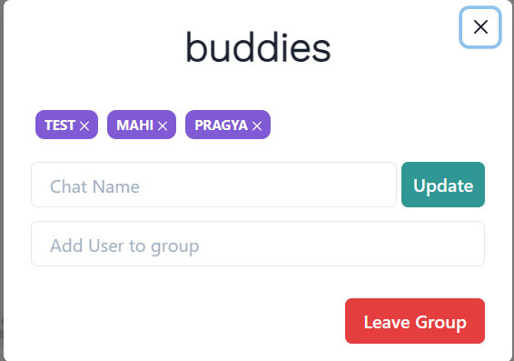

# Talk A Tive

A chat app, short for "chat application," is a software platform designed to facilitate real-time communication between users over the internet. The primary purpose of a chat app is to enable individuals or groups to exchange text-based messages, multimedia content, and sometimes even voice or video calls, all in a seamless and interactive manner. These apps can be used for personal, social, or business communication, and they often come with various features to enhance the user experience. Here's a general description of the components and features you might find in a typical chat app:

- User Registration and Authentication: Users need to create accounts with unique usernames or email addresses and set up secure passwords. Some apps might also support social media or single sign-on (SSO) integration for easier account creation.

- Contact List: Users can add other users as contacts or friends within the app. This list is often used to initiate conversations with existing connections.

- One-on-One Chats: Users can engage in private conversations with individuals. Messages are sent and received in real-time, allowing for instantaneous communication.

- Group Chats: Users can create or join group conversations, allowing multiple participants to communicate together. Group chats are particularly useful for coordinating among teams or discussing common interests.

## Flowchart

## Screenshots

| Personal Chats                     | Group Chat                  |
| ---------------------------------- | --------------------------- |
|  |  |

   

## Features

- User Registration and Authentication: Users can create an account and log in to access the full functionality of the app.
- Responsive Design: The app is designed to be mobile-friendly, providing an optimal experience on various devices.

## Technologies Used

- Frontend:React.js, CSS, Chakra-UI
- Back-end: NodeJS, ExpressJS,SocketIO
- Database: mongoDB
- Authentication: JWT (JSON Web Tokens)
- Deployment: Netlify

## Getting Started

You can setup the project by following this guide [Setup Project](Getting_Started.md).

## License

The Inspire Shot app is licensed under the [MIT License](LICENSE.md).
